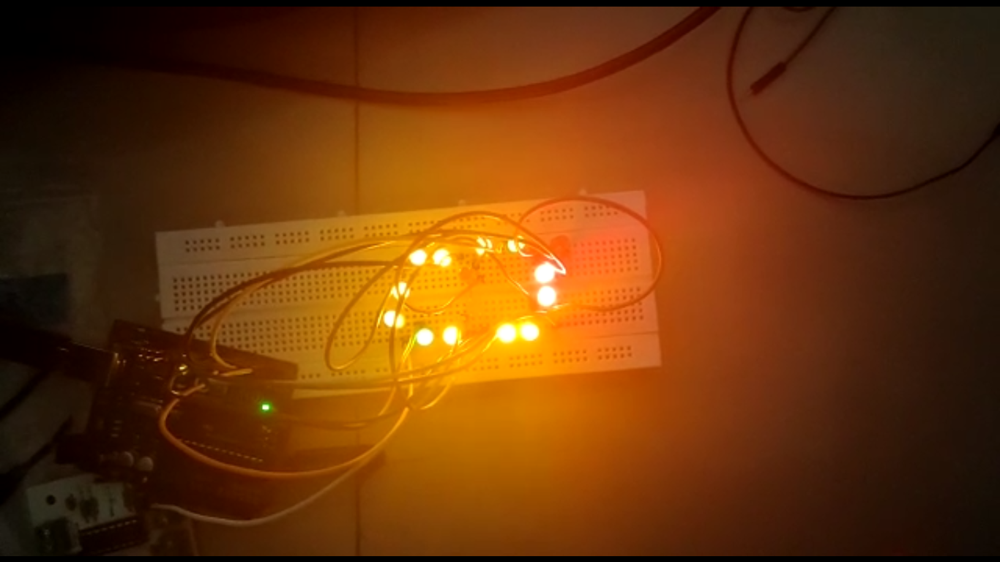
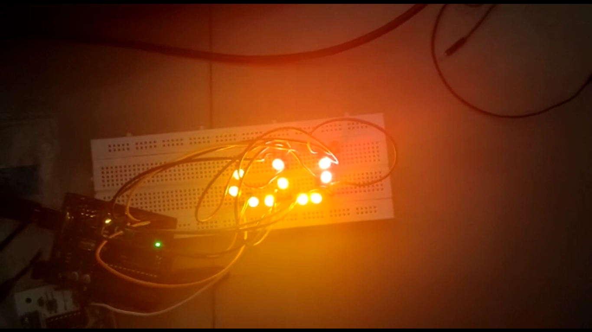

# LED-patterns

Arduino Uno : Arduino/Genuino Uno is a microcontroller board based on the ATmega328P (datasheet). It has 14 digital input/output pins (of which 6 can be used as PWM outputs), 6 analog inputs, a 16 MHz quartz crystal, a USB connection, a power jack, an ICSP header and a reset button. It contains everything needed to support the microcontroller; simply connect it to a computer with a USB cable or power it with a AC-to-DC adapter or battery to get started.. You can tinker with your UNO without worring too much about doing something wrong, worst case scenario you can replace the chip for a few dollars and start over again.

In this project we made seven sigment display only with LED and controller(Arduino). Digital I/O pins are connected to leds by controlling those it made seven segmen display

